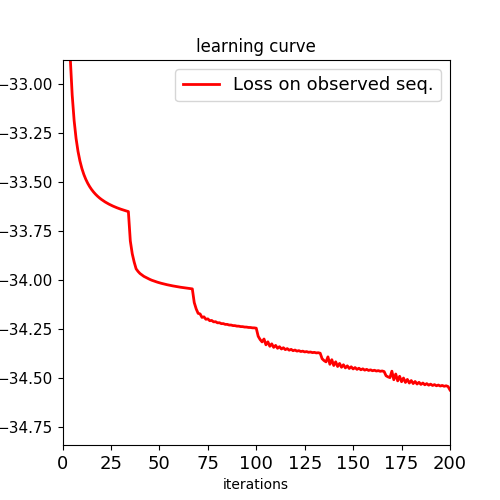
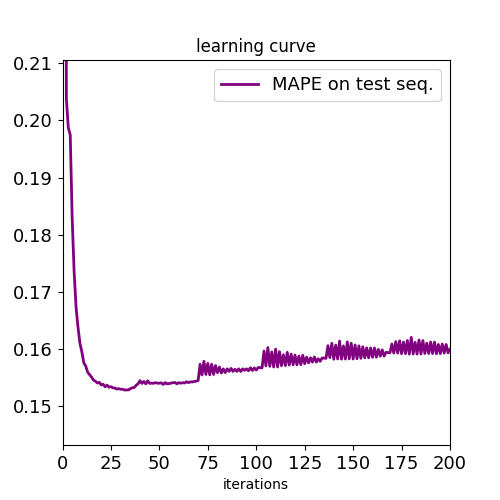
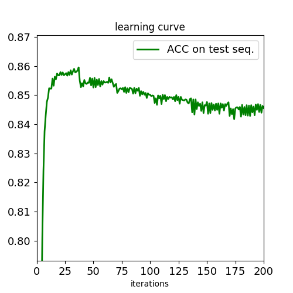

# point process

### Introduction

This project is an experiment for modeling events sequence data based on Poisson point process. The detailed description for algorithms can be found in 

- linkes:

	- IJCAI:[https://www.ijcai.org/Proceedings/16/Papers/380.pdf](https://www.ijcai.org/Proceedings/16/Papers/380.pdf)

	- AAAI:[http://aaai.org/ocs/index.php/AAAI/AAAI17/paper/viewFile/14385/13934](http://aaai.org/ocs/index.php/AAAI/AAAI17/paper/viewFile/14385/13934)

### Pretraing with MLE only

Firstly, we train our point process by maximizing log likelihood on observed sequence, and predict events in the future time interval by time interval. The learning curve is shown as follows.

We can see that the objective declines as the training proceeds, that the objective decreases dramatically each time we employ our efficient EM algorithm. However, pure MLE leads to overfitting too quickly, too much training on observed sequence leads to performance degredation on long-term prediction, which is shown as follows.

Due to this, we split the observed sequence into train sequence and validation sequence to capture signal of overfitting. After performing early stopping of MLE, we will further train our model to gain more accuracy.

### Training with MLE and MSE

We *discretize the timestamp of each event*, this approximate approach leads to deterministic expectation of total events in each time interval, which enables the gradients computation of any loss function w.r.t. parameters in point process model, without losing prediction accuracy in the experiment. We choose mean squared error on the validation sequence as our loss.

$\beta$ must be fixed in MSE-only experiment, otherwise the loss may be rather unstable and even becomes invalid value during training process. We fix $\beta$ to be the optimal value estimated by MLE, 

